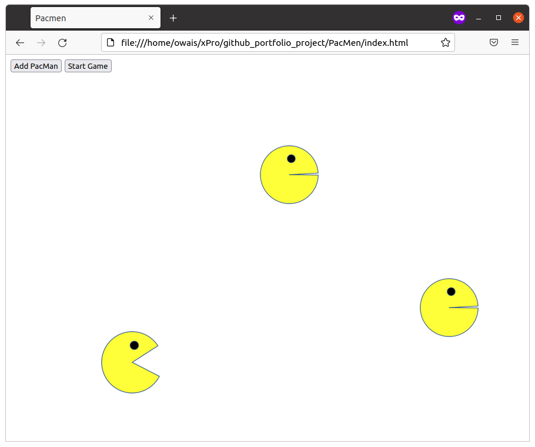

# PacMen
PacMen Exercise Repository for xPro course

Description: This is an exercise in learning how to move and change images while detecting the left and right edges of the screen and keeping within them. When run, the output looks like the video game character PacMan moving back and forth between the left and right edges of the screen with its mouth opening and closing. Additional characters can be added with a button click.

Usage: Copy/download the files in the PacMen folder and then open index.html in a web browser. Click the "Add PacMan" button at the top left of the screen, and then click click the "Start Game" button. You should see something like the following:
 

Roadmap: This exercise can be improved in the future by adding features that will allow continuous animation when other PacMen are added to the screen. It can also include code to change the image of each character to match the direction in which it is traveling.

License: MIT License (NOTE: significant parts of this code was taught and/or provided via the MIT xPRO course in Full Stack Development, and I do not claim ownership over it)

Permission is hereby granted, free of charge, to any person obtaining a copy
of this software and associated documentation files (the "Software"), to deal
in the Software without restriction, including without limitation the rights
to use, copy, modify, merge, publish, distribute, sublicense, and/or sell
copies of the Software, and to permit persons to whom the Software is
furnished to do so, subject to the following conditions:

The above copyright notice and this permission notice shall be included in all
copies or substantial portions of the Software.

THE SOFTWARE IS PROVIDED "AS IS", WITHOUT WARRANTY OF ANY KIND, EXPRESS OR
IMPLIED, INCLUDING BUT NOT LIMITED TO THE WARRANTIES OF MERCHANTABILITY,
FITNESS FOR A PARTICULAR PURPOSE AND NONINFRINGEMENT. IN NO EVENT SHALL THE
AUTHORS OR COPYRIGHT HOLDERS BE LIABLE FOR ANY CLAIM, DAMAGES OR OTHER
LIABILITY, WHETHER IN AN ACTION OF CONTRACT, TORT OR OTHERWISE, ARISING FROM,
OUT OF OR IN CONNECTION WITH THE SOFTWARE OR THE USE OR OTHER DEALINGS IN THE
SOFTWARE.
